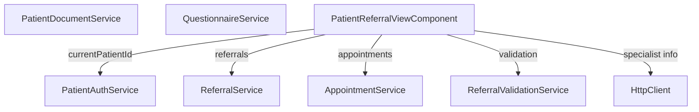

# Patient Portal Context Map & Development Plan

**Last Updated:** 2026-08-19  
**Status:** Active Development  
**Owners:** Patient Portal Team

---

## Executive Summary

The **Patient Portal** is a patient-facing feature of ClinicCare that allows patients to view their referrals, upload documents, complete pre-visit questionnaires, and track appointment status. It's built with Angular 18 standalone components and integrates with multiple backend services through an API gateway.

---

## 1. Architecture Overview

### High-Level Flow

```
Patient Login
    ↓
Patient Portal Shell (Navigation Hub)
    ├─ Referral Management
    │  ├─ View All Referrals (List)
    │  └─ View Single Referral (Detail)
    │     ├─ Appointment Info
    │     ├─ Document Upload Tracker
    │     ├─ Questionnaire Status
    │     └─ Validation Results
    ├─ Document Management
    │  ├─ View Uploaded Documents
    │  └─ Upload New Documents
    └─ Questionnaires
       ├─ View Assigned Questionnaires
       └─ Complete Questionnaire Forms
```

### Technology Stack

- **Frontend Framework:** Angular 18 (Standalone Components)
- **State Management:** Angular Signals
- **Styling:** Component-scoped CSS
- **HTTP Client:** Angular HttpClient
- **Authentication:** PatientAuthService (session-based)
- **Reactive:** RxJS with signal interop (`toSignal`)

---

## 2. Component Architecture

### Component Hierarchy

```
AppComponent (app root)
└── PatientPortalShellComponent (shell)
    ├── PatientReferralListComponent
    ├── PatientReferralViewComponent
    ├── PatientDocumentsComponent
    ├── DocumentUploadComponent
    ├── QuestionnaireListComponent
    └── QuestionnaireFormComponent
```

### Component Details

#### **PatientPortalShellComponent** [shell/patient-portal-shell.component.ts]
- **Purpose:** Main layout and navigation hub
- **Responsibilities:**
  - Display header with patient name and logout button
  - Provide navigation tabs (Referrals, Documents, Questionnaires)
  - Manage router outlet for child components
- **Key Methods:**
  - `logout()` - Clears auth and redirects to login
- **Dependencies:**
  - `PatientAuthService` - For patient name and logout
  - `Router` - For navigation

#### **PatientLoginComponent** [login/patient-login.component.ts]
- **Purpose:** Demo patient selection screen
- **Responsibilities:**
  - Display list of demo patients (hardcoded)
  - Handle patient selection and login
- **Demo Patients:**
  - Anjali Verma (ID: 1)
  - Rajesh Kumar (ID: 2)
  - Divya Menon (ID: 3)
  - Suresh Iyengar (ID: 4)
  - Neha Bhatt (ID: 5)
- **Key Methods:**
  - `select(patient)` - Sets current patient and navigates to portal

#### **PatientReferralListComponent** [patient-referral-list.component.ts]
- **Purpose:** Display all referrals for the logged-in patient
- **Responsibilities:**
  - Load referrals from ReferralService
  - Display as card grid with status badges
  - Show priority, reason, created/updated dates
  - Link to detailed referral view
- **Key Methods:**
  - `loadReferrals()` - Fetches referrals by patient ID
  - `specialtyFromId(doctorId)` - Maps doctor ID to specialty (TODO: fetch from service)
- **Signals:**
  - `referrals` - Array of referrals
  - `loading` - Loading state
- **Features:**
  - Responsive grid layout (3 columns → 1 column on mobile)
  - Status color-coding (Draft, Submitted, Accepted, Rejected, Completed)
  - Priority indicators (Routine, Urgent, Emergent)

#### **PatientReferralViewComponent** [patient-referral-view.component.ts]
- **Purpose:** Detailed view of a single referral with appointment, documents, and validation
- **Responsibilities:**
  - Load and display referral details by ID
  - Fetch specialist name from Doctors Service
  - Show appointment information
  - Display required documents with upload status tracker
  - Show questionnaire completion status
  - Display validation results (completeness checks)
- **Key Methods:**
  - `loadReferral(id)` - Fetches referral and related data
  - `loadSpecialistName(specialistId)` - HTTP call to Doctors Service
  - `validateReferral(referral)` - Calls ReferralValidationService
  - `getStatusLabel(status)` - Maps status to emoji labels
  - `getStatusDescription(status)` - Maps status to descriptions
  - `isDocumentUploaded(docName)` - Checks if document is uploaded
  - `startQuestionnaire()` - Navigates to questionnaire form
- **Signals:**
  - `referral` - Current referral
  - `loading` - Loading state
  - `specialistName` - Specialist's name
  - `requiredDocuments` - Hardcoded list (TODO: fetch from API)
  - `questionnaireCompleted` - Questionnaire status
  - `validationResult` - Validation output
- **Computed:**
  - `appointment` - Finds matching appointment from AppointmentService
- **Data Flow:**
  1. Extract referral ID from route params
  2. Load referral via ReferralService
  3. Fetch specialist name via HttpClient
  4. Load appointments via AppointmentService
  5. Validate referral state via ReferralValidationService
  6. Render UI with results

#### **PatientDocumentsComponent** [documents/patient-documents.component.ts]
- **Purpose:** List and manage patient documents
- **Responsibilities:**
  - Load documents for current patient
  - Display document list (template in HTML file)
  - Handle document downloads
- **Key Methods:**
  - `download(id, filename)` - Triggers document download
- **Dependencies:**
  - `PatientDocumentService` - Document management

#### **DocumentUploadComponent** [documents/document-upload.component.ts]
- **Purpose:** Allow patients to upload new documents
- **Responsibilities:**
  - Handle file selection and upload
  - Show upload progress
  - Provide upload form (template in HTML file)

#### **QuestionnaireListComponent** [questionnaires/questionnaire-list.component.ts]
- **Purpose:** Display assigned questionnaires
- **Responsibilities:**
  - Load questionnaires for current patient
  - Display questionnaire list (template in HTML file)
  - Link to questionnaire forms
- **Dependencies:**
  - `QuestionnaireService` - Questionnaire management

#### **QuestionnaireFormComponent** [questionnaires/questionnaire-form.component.ts]
- **Purpose:** Allow patients to complete questionnaires
- **Responsibilities:**
  - Load questionnaire by ID from route
  - Display form fields
  - Handle form submission (template in HTML file)

---

## 3. Data Flow & Services

### Core Services Used



### Service Responsibilities

#### **PatientAuthService**
- Manages patient session
- Stores current patient ID and name
- Provides `currentPatientId()` and `currentPatientName()` signals
- `demoLogin(id, name)` - Sets patient session
- `logout()` - Clears patient session

#### **ReferralService**
- Loads referrals by patient ID: `loadByPatient(patientId)`
- Exposes `referrals()` signal with all patient referrals
- Communicates with Referral microservice (`/api/referrals`)

#### **AppointmentService**
- Loads appointments for current patient: `loadMyAppointments()`
- Exposes `appointments()` signal
- Filters appointments by referral ID via computed signal

#### **ReferralValidationService**
- Validates referral screen completeness
- `validatePatientComplete(screenData)` returns validation result
- Checks:
  - Documents uploaded
  - Questionnaire completion
  - Appointment scheduled
  - Overall readiness for visit

#### **PatientDocumentService**
- `loadMyDocuments()` - Loads documents for current patient
- `downloadDocument(id, filename)` - Downloads file
- Integrates with Document microservice

#### **QuestionnaireService**
- `loadMyQuestionnaires()` - Loads questionnaires for patient
- Manages questionnaire state and submission
- Integrates with Questionnaire endpoint

### Data Models

#### **Referral** [core/models/referral.model]
```typescript
interface Referral {
  ReferralId: number
  PatientId: number
  ReferringDoctorId: number
  SpecialistId: number
  Reason: string
  Priority: 'Routine' | 'Urgent' | 'Emergent'
  Status: 'Draft' | 'Submitted' | 'Accepted' | 'Rejected' | 'Completed'
  CreatedAt: string (ISO date)
  UpdatedAt: string (ISO date)
}
```

#### **Appointment** [core/models/appointment.model]
```typescript
interface Appointment {
  AppointmentId: number
  ReferralId: number
  PatientId: number
  ScheduledDate: string (ISO date)
  Location: string
  Status: string
}
```

#### **Validation Result** [core/services/referral-validation.service]
```typescript
interface ValidationResult {
  isValid: boolean
  summary: string
  warnings: Array<{
    field: string
    message: string
  }>
}
```

---

## 4. Routes & Navigation

### Route Structure

| Route | Component | Auth Guard | Purpose |
|-------|-----------|-----------|---------|
| `/patient-portal/login` | PatientLoginComponent | No | Demo patient selection |
| `/patient-portal` | Redirect | - | Redirects to `/patient-portal/referrals` |
| `/patient-portal/referrals` | PatientReferralListComponent | Yes | List all referrals |
| `/patient-portal/referrals/:id` | PatientReferralViewComponent | Yes | View single referral |
| `/patient-portal/documents` | PatientDocumentsComponent | Yes | List documents |
| `/patient-portal/documents/upload` | DocumentUploadComponent | Yes | Upload document form |
| `/patient-portal/questionnaires` | QuestionnaireListComponent | Yes | List questionnaires |
| `/patient-portal/questionnaires/:id` | QuestionnaireFormComponent | Yes | Complete questionnaire |

### Navigation Flow

```
Login Page
    ↓ (select patient)
Referrals List ← Main Hub
    ↓                    ↓
Referral Detail      Documents List → Upload
    ↓                                     ↓
Questionnaire Form ←─────────────────────┘
```

---

## 5. Features & Current State

### ✅ Implemented

1. **Patient Authentication**
   - Demo login with 5 hardcoded patients
   - Session management via signals
   - Auth guard on protected routes

2. **Referral Management**
   - View all referrals in grid layout
   - View detailed referral status
   - Display specialist assignment
   - Track appointment scheduling
   - Show validation warnings
   - Document upload tracker (UI only)
   - Questionnaire status indicator

3. **Navigation**
   - Persistent shell with header and nav tabs
   - Breadcrumb-style navigation
   - Logout functionality

### 🟡 Partially Implemented

1. **Document Management**
   - UI structure for document list
   - Download button (implementation in service)
   - No upload progress display yet

2. **Questionnaires**
   - List view component created
   - Form component created
   - No form validation logic yet

3. **Backend Integration**
   - Some hardcoded data (specialties, required documents)
   - Specialist name fetched via HTTP
   - Validation service used but limited checks

### ❌ Not Implemented

1. **Real Authentication**
   - Currently demo/session-based only
   - No backend user validation
   - No JWT or OAuth

2. **Document Upload**
   - UI exists but no upload logic
   - No progress tracking
   - No file type validation

3. **Questionnaire Logic**
   - Form fields hardcoded
   - No dynamic field rendering
   - No submission handler

4. **Advanced Features**
   - Notifications on status change
   - Document sharing with doctors
   - Appointment rescheduling
   - Referral messaging system

---

## 6. UI/UX Design

### Color Scheme

- **Primary Blue:** #2196f3 (buttons, links)
- **Success Green:** #4caf50 (completed status)
- **Warning Orange:** #ff9800 (pending/warning)
- **Error Red:** #f44336 (rejected)
- **Neutral:** #666 (text), #f5f5f5 (backgrounds)

### Layout Patterns

1. **Card-Based Design**
   - Referral cards in grid (320px min width, auto-fill)
   - Full-width detail cards
   - Responsive: 3 columns → 1 column on mobile

2. **Status Badges**
   - Color-coded by status
   - Rounded pills with bold text
   - Positioned in card headers

3. **Section Grouping**
   - Major sections separated by dividers
   - Clear H3 headings
   - Consistent spacing (20px margins/padding)

### Responsive Breakpoints

- **Desktop:** Full layout (1200px max-width)
- **Tablet:** 2 column grid (768px)
- **Mobile:** 1 column stacked (< 768px)

---

## 7. Backend Integration Points

### API Endpoints Called

| Service | Endpoint | Method | Purpose |
|---------|----------|--------|---------|
| Gateway | `/api/referrals` | GET | List patient referrals |
| Doctors | `/api/doctors/{id}` | GET | Fetch specialist name |
| Appointments | `/api/appointments` | GET | List appointments |
| Documents | `/api/documents` | GET/POST | Manage documents |
| Questionnaires | `/api/questionnaires` | GET/POST | Manage forms |

### Error Handling

- **Current:** Basic error messages ("Referral not found")
- **Missing:** 
  - Service unavailability handling
  - Retry logic
  - User-friendly error states
  - Timeout handling

---

## 8. Known Limitations & TODOs

### High Priority

- [ ] **Document Upload Logic** - Implement actual file upload in `DocumentUploadComponent`
- [ ] **Questionnaire Submission** - Add form validation and submit handler
- [ ] **Specialist Lookup** - Replace hardcoded specialty mapping with service call
- [ ] **Required Documents** - Fetch from backend instead of hardcoding in component
- [ ] **Document Status Tracking** - Link document list with uploaded documents
- [ ] **Validation Warnings** - Expand validation service to check all referral readiness criteria

### Medium Priority

- [ ] **Error Handling** - Add retry logic and error boundary
- [ ] **Loading States** - Improve loading indicators (skeleton screens)
- [ ] **Accessibility** - Add ARIA labels and keyboard navigation
- [ ] **Performance** - Lazy load appointments and documents
- [ ] **Notifications** - Toast alerts for actions (upload success, etc.)

### Low Priority

- [ ] **Real Authentication** - Replace demo login with proper auth
- [ ] **Document Sharing** - Allow sharing with specialists
- [ ] **Offline Mode** - Cache data for offline viewing
- [ ] **Mobile App** - Native mobile companion

---

## 9. Development Guidelines

### Adding a New Feature

#### Step 1: Create Component
```bash
ng generate component features/patient-portal/feature-name/feature-name.component --standalone
```

#### Step 2: Update Routes
Add route to `app.routes.ts`:
```typescript
{ 
  path: 'patient-portal/feature-name', 
  component: FeatureNameComponent,
  canActivate: [patientAuthGuard] 
}
```

#### Step 3: Add Navigation Link
Update `patient-portal-shell.component.html`:
```html
<a routerLink="/patient-portal/feature-name" routerLinkActive="active">Feature</a>
```

#### Step 4: Implement Component
- Use Angular signals for state
- Inject required services
- Follow existing style patterns
- Add responsive CSS

### Service Injection Pattern

```typescript
@Component({
  selector: 'app-my-component',
  standalone: true,
  imports: [CommonModule],
})
export class MyComponent {
  private auth = inject(PatientAuthService);
  private service = inject(MyService);
  
  // Use signals for reactive state
  data = signal<any[]>([]);
  
  ngOnInit() {
    this.service.load(this.auth.currentPatientId());
  }
}
```

### Styling Guidelines

- Use component-scoped CSS (styleUrl)
- Follow mobile-first responsive design
- Use consistent spacing (8px, 10px, 15px, 20px)
- Leverage existing color scheme
- Test on mobile devices

### Testing

- Component logic tested via Jasmine
- Run `npm test` from `/frontend` directory
- Include unit tests for:
  - Signal updates
  - Service method calls
  - Navigation logic
  - Computed properties

---

## 10. Deployment Considerations

### Frontend Build
```bash
cd frontend
npm run build
```

### Environment Configuration
- API base URL: `localhost:8000/api` (dev)
- Adjust in `core/config.ts` for production

### Browser Compatibility
- Chrome/Edge: Full support
- Firefox: Full support
- Safari: Tested (Angular 18 compatible)
- IE11: Not supported (Standalone components)

### Performance Metrics
- Initial load: < 3s
- Referral list render: < 500ms
- Component lazy loading: Implement for documents/questionnaires

---

## 11. Quick Start for Developers

### Setup Patient Portal Locally

```bash
# 1. Install frontend dependencies
cd frontend
npm install

# 2. Start dev server
npm start
# Opens http://localhost:4200

# 3. Ensure backend is running
docker-compose up -d

# 4. Access patient portal
# Navigate to http://localhost:4200/patient-portal/login
# Select a demo patient
```

### Common Development Tasks

#### View a Referral
1. Login with any demo patient
2. Click "Referrals" tab
3. Click "View Details" on any referral card

#### Test Document Upload
1. From referral detail, note required documents
2. Click to navigate to Documents → Upload
3. Test file selection (currently UI only)

#### Add a Validation Check
1. Edit `ReferralValidationService`
2. Add check to `validatePatientComplete()` method
3. Return warning if condition not met
4. Validation appears in "Validation Status" section

#### Debug Referral Loading
1. Open browser DevTools (F12)
2. Navigate to referral list
3. Check Network tab for `/api/referrals` call
4. Verify response in Application → signals (Angular DevTools)

---

## 12. File Structure Reference

```
frontend/
└── src/app/
    ├── core/
    │   ├── models/
    │   │   └── referral.model.ts
    │   └── services/
    │       ├── patient-auth.service.ts
    │       ├── referral.service.ts
    │       ├── appointment.service.ts
    │       ├── referral-validation.service.ts
    │       ├── patient-document.service.ts
    │       └── questionnaire.service.ts
    ├── features/
    │   └── patient-portal/
    │       ├── shell/
    │       │   ├── patient-portal-shell.component.ts
    │       │   ├── patient-portal-shell.component.html
    │       │   └── patient-portal-shell.component.css
    │       ├── login/
    │       │   └── patient-login.component.ts
    │       ├── documents/
    │       │   ├── patient-documents.component.ts
    │       │   ├── patient-documents.component.html
    │       │   ├── patient-documents.component.css
    │       │   ├── document-upload.component.ts
    │       │   ├── document-upload.component.html
    │       │   └── document-upload.component.css
    │       ├── questionnaires/
    │       │   ├── questionnaire-list.component.ts
    │       │   ├── questionnaire-list.component.html
    │       │   ├── questionnaire-list.component.css
    │       │   ├── questionnaire-form.component.ts
    │       │   ├── questionnaire-form.component.html
    │       │   └── questionnaire-form.component.css
    │       ├── patient-referral-list.component.ts
    │       └── patient-referral-view.component.ts
    ├── app.routes.ts
    └── app.component.ts
```

---

## 13. Related Documentation

- **CLAUDE.md** - Main project documentation
- **README_PHARMACY_FEATURE.md** - Pharmacy integration
- **PHARMACY_TEST_REPORT.md** - Pharmacy testing guide
- **QUICKSTART.md** - 5-minute setup

---

## 14. Contact & Ownership

- **Product Owner:** [Healthcare Team Lead]
- **Frontend Lead:** [Frontend Lead Name]
- **Backend Integration:** [API Team]

**Last Updated:** 2026-08-19  
**Version:** 1.0

---

## Change Log

| Date | Change | Author |
|------|--------|--------|
| 2026-08-19 | Initial context map created | Claude Code |
