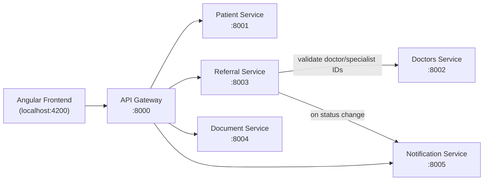

# ReferralIQ — Clinical Referral & Care Coordination Platform

## Version 1 Specification

---

## 1. Overview

ReferralIQ is a training/demo platform modeled on the systems used between
primary care physicians, specialists, labs, and hospitals to manage patient
referrals. A physician refers a patient to a specialist; the platform tracks
that referral from creation through acceptance, alongside the patient's
record and supporting documents.

This is Version 1 — a working starting point. It is deliberately incomplete
in scope (see Section 8) to leave room for features to be added in later
project phases.

---

## 2. Goals for Version 1

- A realistic, working microservices application — not a single monolith —
  with clear service boundaries and real network calls between services.
- Simple enough to build and reason about quickly: SQLite per service, no
  external infrastructure, no cloud dependencies.
- A complete, demoable workflow: search for a patient, view their record,
  create a referral, submit it, and have it accepted or rejected.
- Enough structure (services, data model, workflow) that new features can
  be added cleanly in later phases without re-architecting.

---

## 3. Tech Stack

- **Frontend:** Angular (standalone components, signals-based state
  preferred), plain CSS — no UI framework required.
- **Backend services:** Python (FastAPI) for all services unless otherwise
  noted below.
- **Database:** SQLite, one database file per service — each service owns
  its own schema exclusively. No service reads another service's database
  directly; all cross-service data access happens over HTTP.
- **Inter-service communication:** plain REST/JSON over HTTP.

---

## 4. Architecture



The Angular frontend talks only to the API Gateway — it never calls a
backend service directly. The Gateway routes requests to the appropriate
service. Referral Service calls Doctors Service directly (server-to-server)
to validate referring doctor and specialist IDs, and calls Notification
Service on referral status changes.

---

## 5. Services

### 5.1 API Gateway (`:8000`)

Routes incoming frontend requests to the correct backend service. No
business logic or data storage of its own — a thin routing layer only.

| Route (example) | Forwards to |
|---|---|
| `/api/patients/*` | Patient Service |
| `/api/doctors/*` | Doctors Service |
| `/api/referrals/*` | Referral Service |
| `/api/documents/*` | Document Service |
| `/api/notifications/*` | Notification Service |

### 5.2 Patient Service (`:8001`)

Owns patient demographic and clinical background data.

**Data model:**
```
Patient
  PatientId (PK)
  Name
  DOB
  Gender

Allergy
  AllergyId (PK)
  PatientId (FK)
  Substance
  Severity

ChronicCondition
  ConditionId (PK)
  PatientId (FK)
  Name
  DiagnosedDate

Medication
  MedicationId (PK)
  PatientId (FK)
  Name
  Dosage
  Active (boolean)
```

**Endpoints:**
- `GET /patients` — list/search patients (by name)
- `GET /patients/{id}` — full patient record, including allergies,
  conditions, and medications
- `POST /patients` — create a patient (for seeding/demo data)

### 5.3 Doctors Service (`:8002`)

Owns referring physicians and specialists.

**Data model:**
```
Doctor
  DoctorId (PK)
  Name
  Specialty
  Department
  ContactInfo
```

**Endpoints:**
- `GET /doctors` — list/search doctors (optionally filter by specialty)
- `GET /doctors/{id}` — single doctor record
- `GET /doctors/{id}/exists` — lightweight existence check, returns
  `{"exists": true|false}` (used by Referral Service to validate IDs)
- `POST /doctors` — create a doctor (for seeding/demo data)

### 5.4 Referral Service (`:8003`)

Owns the referral lifecycle — the core workflow of the application.

**Data model:**
```
Referral
  ReferralId (PK)
  PatientId
  ReferringDoctorId
  SpecialistId
  Reason
  Priority        (enum: Routine | Urgent | Emergent)
  Status          (enum: Draft | Submitted | Accepted | Rejected | Completed)
  CreatedAt
  UpdatedAt
```

**Endpoints:**
- `GET /referrals` — list referrals (filterable by patient, status)
- `GET /referrals/{id}` — single referral
- `POST /referrals` — create a referral in `Draft` status
- `PATCH /referrals/{id}/submit` — transitions `Draft → Submitted`
- `PATCH /referrals/{id}/accept` — transitions `Submitted → Accepted`
- `PATCH /referrals/{id}/reject` — transitions `Submitted → Rejected`
- `PATCH /referrals/{id}/complete` — transitions `Accepted → Completed`

**Required validation behavior:**
- On `POST /referrals`, Referral Service must call Doctors Service's
  `GET /doctors/{id}/exists` for both `ReferringDoctorId` and
  `SpecialistId` before creating the record. If either doctor does not
  exist, reject the request with a 400 and a clear error message.
- On every status transition, Referral Service calls Notification
  Service to record the event (see 5.6).

### 5.5 Document Service (`:8004`)

Owns document **metadata** only — no actual file storage or upload
handling in Version 1.

**Data model:**
```
Document
  DocumentId (PK)
  PatientId
  ReferralId (nullable)
  Type        (enum: Lab Report | Imaging | Referral Letter | Discharge Summary)
  UploadedDate
  FileName
```

**Endpoints:**
- `GET /documents?patientId={id}` — list documents for a patient
- `GET /documents?referralId={id}` — list documents for a referral
- `POST /documents` — create a document metadata record (no actual file
  upload — just the metadata fields above)

### 5.6 Notification Service (`:8005`)

Records events for referral status changes. No external delivery (no
real email/SMS) in Version 1 — write to its own database and print to
console.

**Data model:**
```
Notification
  NotificationId (PK)
  ReferralId
  EventType     (enum: Submitted | Accepted | Rejected | Completed)
  Timestamp
  Message
```

**Endpoints:**
- `GET /notifications?referralId={id}` — list notification history for
  a referral
- `POST /notifications` — record a new notification event (called by
  Referral Service on status transitions)

---

## 6. Frontend (Angular)

**Screens:**
- **Login** — simple mock login (no real auth required for V1; a single
  hardcoded demo user is sufficient)
- **Dashboard** — summary view (e.g., referral counts by status)
- **Patients** — search/list patients
- **Patient Details** — full patient record (demographics, allergies,
  conditions, medications, associated documents)
- **Create Referral** — form to create a new referral for a patient,
  selecting a referring doctor and specialist from Doctors Service
- **Referral Tracking** — list of referrals with current status, with
  actions to submit/accept/reject/complete
- **Documents** — list of document metadata for a patient or referral

The frontend calls only the API Gateway (`localhost:8000`), never a
backend service directly.

---

## 7. Workflow

```
Draft → Submitted → Accepted → Completed
                  ↘ Rejected
```

A doctor creates a referral (`Draft`), submits it (`Submitted`), and the
specialist's office either accepts it (`Accepted`) or rejects it
(`Rejected`). An accepted referral is eventually marked `Completed` once
the consultation has occurred.

---

## 8. Explicitly Out of Scope for Version 1

- **Appointment scheduling.** There is intentionally no Appointment
  entity, table, or service in Version 1. An `Accepted` referral has no
  automatic next step beyond that status — this is a deliberate gap,
  reserved for a later project phase.
- Real file upload/storage for documents (metadata only, as specified).
- Real notification delivery (email/SMS) — console/database logging
  only.
- Real authentication/authorization.
- Any UI styling beyond basic usability — visual polish is not a goal
  for Version 1.

---

## 9. Non-Functional Notes

- Each service should be independently runnable (its own `docker-compose`
  entry or equivalent start script), consistent with the port assignments
  in Section 4.
- Seed each service with a small amount of realistic demo data (a
  handful of patients, doctors, and referrals in various statuses) so the
  application feels populated on first run, not empty.
- CORS should be scoped to the frontend's origin (`http://localhost:4200`)
  only.
